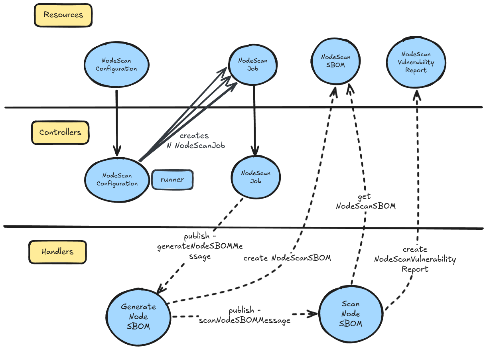

|              |                                 |
| :----------- | :------------------------------ |
| Feature Name | Node Scan                       |
| Start Date   | March 5th, 2026                 |
| Category     | Architecture                    |
| RFC PR       | [#922](https://github.com/kubewarden/sbomscanner/pull/922) |
| State        | **ACCEPTED**                    |

# Summary

[summary]: #summary

Define the architectural and functional requirements for scanning Kubernetes cluster nodes.

# Motivation

[motivation]: #motivation

We aim to develop a full-stack, SBOM-based security scanner for Kubernetes.
Because nodes are the foundation of the cluster, maintaining visibility into their 
security posture is critical.

This feature provides a comprehensive overview of node-level vulnerabilities, 
ensuring the safety of the infrastructure where workloads reside.

## Examples / User Stories

[examples]: #examples

- As a user, I want to have a comprehensive overview of node-level vulnerabilities, ensuring the safety of the infrastructure where workloads reside.
- As a user, I want to automatically scan cluster nodes for vulnerabilities on a recurring basis.
- As a user, I want to define the scan interval for my nodes.
- As a user, I want the ability to exclude specific files or directories from the scan to reduce noise or avoid sensitive paths.

# Detailed design

[design]: #detailed-design

Node scanning is implemented by deploying a `DaemonSet` that executes a worker 
component on every node.

The worker will be provided with these new flags:
* `--mode` to operate between `registry` and `node` scanning
* `--node-name` to specify the name of the node to be scanned (only used in `node` scanning mode)

This approach will allow for significant code reuse across different scan targets.
When `--mode=node` is set, the `--node-name` flag must be provided, 
and the worker will subscribe to the NATS subject `sbomscanner.nodescan.{node-name}` 
to receive scan jobs specific to that node.
It will sit idle most of the time and perform the job only when requested to do it.

This feature also allows nodes to be excluded from the scan (eg. if they don't have enough resources).
This can be achieved with the `nodeSelector`, where only nodes matching the selector 
are considered for scanning. If not specified, all the nodes are going to be scanned.

To trigger a new scan, the user can set the `scanInterval` on the `NodeScanConfiguration`,
or leave the `scanInterval` not set and apply a `NodeScanJob` manually 
(with the `NodeScanConfiguration` already applied) as we already do for the `Registry`.

Please, note that `NodeScanConfiguration` is a singleton resource, 
meaning that there can be only one instance of it in the cluster.

## CRDs

For this feature we are going to add the following CRDs:

* `NodeScanConfiguration`: Defines the global scan settings.
  * `scanInterval`: Duration between automated scans.
    If not specified, the `NodeScanJob` doesn't start.
  * `nodeSelector`: Filter which nodes are scanned.
    If not specified, all the nodes are scanned.
  * `skip`: A list of file/directory paths to be ignored.

* `NodeScanJob`: Represents a single execution of a node scan.
  * `nodeName`: The name of the node to be scanned.

* `NodeSBOM`: Stores the Software Bill of Materials for a specific node.

* `NodeVulnerabilityReport`: Contains the results of the vulnerability analysis.

Here's the overview of the resources landscape:

### NodeMetadata Struct

`NodeSBOM` and `NodeVulnerabilityReport` are equal to the [`SBOM`](https://github.com/kubewarden/sbomscanner/blob/main/api/storage/v1alpha1/sbom_types.go) and 
[`VulnerabilityReport`](https://github.com/kubewarden/sbomscanner/blob/main/api/storage/v1alpha1/vulnerabilityreport_types.go) resource, execept for except for [`ImageMetadata`](https://github.com/kubewarden/sbomscanner/blob/main/api/storage/v1alpha1/image_metadata.go).
In this case, we are going to use the `NodeMetadata` structure to store 
information about the node.

`NodeMetadata` will have the following attributes:

* `Name` specifies the unique name of the node in the cluster.
* `Platform` specifies the OS + CPU architecture of the node. Example: linux/amd64, linux/arm64.

## Scan Workflow

1. The user applies a `NodeScanConfiguration` with a defined `scanInterval` or applies a `NodeScanJob` manually.
2. The controller creates a `NodeScanJob` for each node matching the `nodeSelector` (or all nodes if no selector is specified).
3. Each worker subscribes to the NATS subject `sbomscanner.nodescan.{node-name}` and receives the scan job for its node.
4. The worker executes the scan, generating a `NodeSBOM` and a `NodeVulnerabilityReport` for the node.
5. The results are stored in the cluster and can be accessed by the user for review and remediation.

To let users easily understand the flow, here's a simple diagram:

Without the `NodeScanConfiguration`, users can not run `NodeScanJob` independently,
since the `NodeScanJob` needs the configurations defined in the `NodeScanConfiguration` to run (eg. the `skip` list).

When a new `NodeScanJob` is created, it checks if another `NodeScanJob` is already in progress for the same node.
If there is an active job, the new job will be marked as `Failed` with the reason `ScanAlreadyInProgress`.

## Status Conditions

NodeScanJobs will have status conditions to provide visibility into the scan process.

The `NodeScanJob` has status conditions very similar to [`ScanJob`](https://github.com/kubewarden/sbomscanner/blob/main/api/v1alpha1/scanjob_types.go#L36):

Status: `Scheduled` (The job is created but hasn't started doing actual work)
* `Scheduled`: The system has accepted the request and scheduled it.
* `Pending`: The job is in the queue waiting for resources or an executor to pick it up.

Status: `InProgress` (The job is actively executing)
* `InProgress`: Generic indicator that execution has started.
* `NodeScanInProgress`: Currently scanning the node's filesystem and collecting data.
* `SBOMGenerationInProgress`: Currently parsing dependencies and building the SBOM document.

Status: `Complete` (The job finished successfully)
* `Complete`: Generic success indicator.
* `NodeScanned`: The node has been successfully scanned, and the SBOM and vulnerability report are generated.

Status: `Failed` (The job encountered a terminal error)
* `Failed`: Generic failure indicator (e.g., bad user input, invalid target).
* `InternalError`: Failed due to an unexpected system crash, out-of-memory error, or infrastructure issue.
* `ScanAlreadyInProgress`: Failed because another scan job is already running for the same node.

As for the `WorkloadScan` status conditions, the mechanism works the same.
When `Scheduled` is `true`, then all the other conditions are `false` and their reason is `Scheduled`. 
When `Pending` is `true`, then all the other conditions are `false` and their reason is `Pending`.
When `InProgress` is `true`, then all the other conditions are `false` and their reason is `InProgress`.
When `Complete` is `true`, then all the other conditions are also `false` and their reason is `Complete`.

# Drawbacks

[drawbacks]: #drawbacks

Mounting the host filesystem into a container bridges the isolation boundary and 
introduces significant risk. To mitigate potential host compromise, the `DaemonSet` 
must mount the host root filesystem as `readOnly: true`.
